# 🛍️ Mall Customer Segmentation — Unsupervised Learning (PR 1)

**Clustering mall customers with K-Means, Agglomerative Hierarchical Clustering and DBSCAN**

   

| | |
|---|---|
| **Institute** | Red & White Skill Education |
| **Subject** | Unsupervised Learning — Practical Report 1 (PR 1) |
| **Student** | Tanna Herit · GRID: 11431 |
| **Notebook** | [`UL_PR1.ipynb`](UL_PR1.ipynb) · [HTML version](UL_PR1.html) |

---

## 📑 Table of Contents

1. [Project Overview](#-project-overview)
2. [Video Explanation](#-video-explanation)
3. [Dataset](#-dataset)
4. [Algorithms Used](#-algorithms-used)
5. [Workflow](#-workflow)
6. [Results & Screenshots](#-results--screenshots)
7. [Algorithm Comparison](#-algorithm-comparison)
8. [Business Insights](#-business-insights)
9. [Tools & Technologies](#-tools--technologies)
10. [Requirements & Installation](#-requirements--installation)
11. [Repository Structure](#-repository-structure)
12. [Author](#-author)

---

## 🎯 Project Overview

A shopping mall wants to understand **who its customers are** so that marketing can be targeted instead of generic. This project groups 200 mall customers into segments using **three unsupervised learning algorithms** and compares them side by side:

- **K-Means** (centroid-based)
- **Agglomerative Hierarchical Clustering** (connectivity-based, Ward linkage)
- **DBSCAN** (density-based)

The whole analysis is done in a single Jupyter Notebook: data loading and EDA → feature scaling → the three clustering algorithms → metrics-based comparison → business recommendations for mall management.

**Main finding:** customers fall into **5 clear segments** based on annual income and spending score. K-Means and Hierarchical clustering agree on 196 of 200 customers, while DBSCAN finds 4 dense regions plus 15 noise points. **K-Means is recommended for deployment.**

---

## 🎥 Video Explanation

▶️ **Watch the video walkthrough (face + screen, ~8 minutes):** [PASTE YOUR GOOGLE DRIVE / YOUTUBE LINK HERE](PASTE_LINK_HERE)

The video explains: why scaling is needed, how to read the Elbow and Silhouette plots, how to read a dendrogram (and what Ward linkage minimises), what `eps` and `min_samples` control in DBSCAN, how the three algorithms differ, and what the segments mean for the business.

---

## 📊 Dataset

| Field | Detail |
|---|---|
| **Name** | Mall Customer Segmentation Data |
| **Source** | Kaggle |
| **URL** | <https://www.kaggle.com/datasets/vjchoudhary7/customer-segmentation-tutorial-in-python> |
| **File** | [`Mall_Customers.csv`](Mall_Customers.csv) — 200 rows × 5 columns |
| **Quality** | No missing values, no duplicate rows |
| **Domain** | Retail / Customer Analytics |
| **License** | CC0: Public Domain |

| Column | Type | Description |
|---|---|---|
| `CustomerID` | Integer | Unique customer identifier (1–200). Dropped before modelling. |
| `Gender` | Text | Male / Female. Encoded with `LabelEncoder` (Female = 0, Male = 1). |
| `Age` | Integer | Customer age in years (18–70). |
| `Annual Income (k$)` | Integer | Annual income in thousands of USD (15–137). Renamed to `Annual_Income`. |
| `Spending Score (1-100)` | Integer | Score assigned by the mall from purchasing behaviour (1–99). Renamed to `Spending_Score`. |

---

## 🧠 Algorithms Used

### 1. K-Means Clustering
**Idea:** Pick *k* centroids, assign every customer to the nearest centroid, move each centroid to the mean of its customers and repeat until nothing changes. It minimises **inertia** (the sum of squared distances to the cluster centre).

- **Choosing k:** Elbow method (k = 1–10) and Silhouette score (k = 2–10). Both point to **k = 5** (silhouette ≈ 0.555).
- **Settings:** `KMeans(n_clusters=5, random_state=42, n_init=10)`
- **Strengths:** fast, simple, very easy to interpret. **Limits:** needs k in advance, assumes round clusters, forces every point into a cluster.

### 2. Agglomerative Hierarchical Clustering
**Idea:** Start with every customer as its own cluster and repeatedly merge the two closest clusters. **Ward linkage** merges the pair that causes the smallest increase in total within-cluster variance. The merge history is drawn as a **dendrogram**.

- **Choosing the number of clusters:** cut the dendrogram through the longest vertical gap (Ward distance ≈ 4.4 → 9.5, cut at ≈ 6.9) → **5 clusters**.
- **Settings:** `AgglomerativeClustering(n_clusters=5, linkage='ward')`
- **Strengths:** no random start, gives a full hierarchy that is good for presentations. **Limits:** slower on big data, merges cannot be undone.

### 3. DBSCAN (Density-Based Spatial Clustering of Applications with Noise)
**Idea:** A point with at least `min_samples` neighbours within radius `eps` is a *core point*. Connected core points form a cluster. Points that are too far from any dense area are labelled **noise (−1)**.

- **Tuning:** 4-NN distance plot (knee ≈ 0.4) and a grid search over `eps` ∈ {0.2 … 0.6} × `min_samples` ∈ {3 … 6}.
- **Settings:** `DBSCAN(eps=0.4, min_samples=5)` → 4 clusters + 15 noise points.
- **Strengths:** no k needed, finds arbitrary shapes, detects outliers. **Limits:** sensitive to `eps`; merges groups that touch each other (as happens here).

---

## 🔄 Workflow

| Task | What was done |
|---|---|
| **1. Loading & EDA** | Loaded the CSV, checked shape / nulls / duplicates, renamed columns, dropped `CustomerID`, encoded Gender, plotted histograms with KDE, a pairplot and a correlation heatmap, and wrote an EDA summary. |
| **2. Scaling & Feature Selection** | Applied `StandardScaler` to Age, Annual_Income and Spending_Score (`df_scaled`), created the 2-feature subset `df_2f` and explained why scaling matters for distance-based algorithms. |
| **3. K-Means** | Elbow + Silhouette to choose k, fitted the model, plotted clusters with centroids and built a named cluster profile table. |
| **4. Hierarchical** | Ward dendrogram with a cut line, fitted the model, compared it with K-Means side by side and compared the cluster profiles. |
| **5. DBSCAN** | k-distance plot, grid search over `eps` and `min_samples`, fitted the final model, plotted noise points and compared it conceptually with K-Means. |
| **6. Comparison & Insights** | Three-panel comparison figure, metrics table (Silhouette, Davies-Bouldin, Calinski-Harabasz), business insight report and an extension using all 4 features. |
| **7. Quality** | Consistent style, opening Markdown cell for every task, clean *Restart & Run All*, HTML export and `requirements.txt`. |

---

## 📸 Results & Screenshots

All plots are saved in the [`screenshots/`](screenshots) folder.

### Task 1 — Exploratory Data Analysis

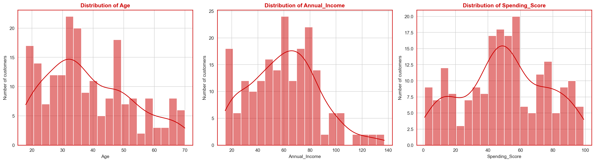
*Figure 1 — Histograms with KDE curves for Age, Annual Income and Spending Score. Age is concentrated between 25 and 50, income is right-skewed and spending score is spread across the full range.*

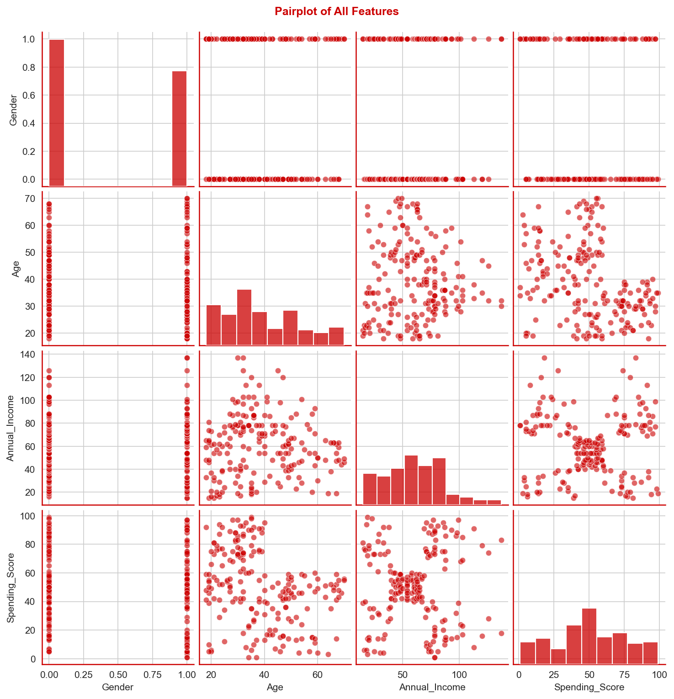
*Figure 2 — Pairplot of all features. The Annual Income vs Spending Score panel shows five separate dense groups.*

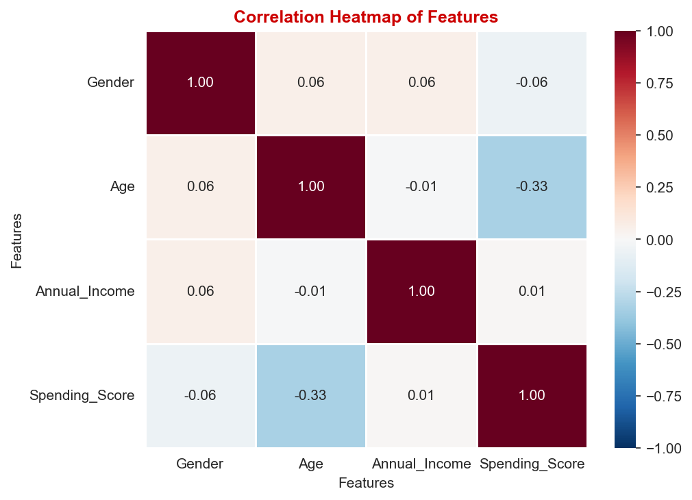
*Figure 3 — Correlation heatmap. Correlations are weak: Age vs Spending Score is about −0.33, and Income vs Spending Score is about 0.01.*

### Task 3 — K-Means

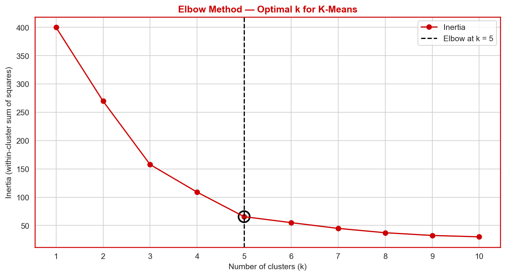
*Figure 4 — Elbow method. The curve bends at k = 5 (going from 5 to 6 clusters reduces inertia by only ~16%).*

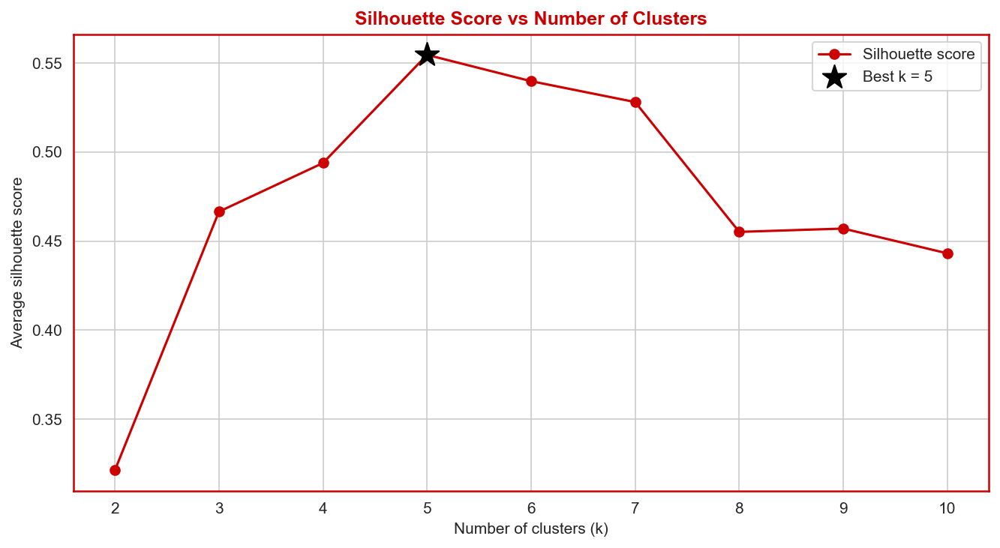
*Figure 5 — Silhouette score for k = 2–10. The highest score (≈ 0.555) is at k = 5, which agrees with the elbow.*

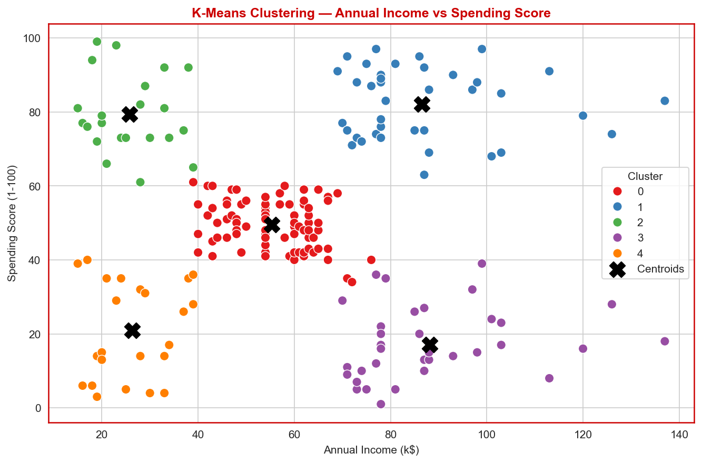
*Figure 6 — K-Means clusters on Annual Income vs Spending Score, with the centroids marked as black X.*

### Task 4 — Agglomerative Hierarchical Clustering

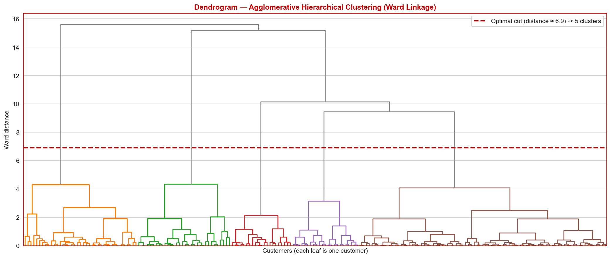
*Figure 7 — Ward-linkage dendrogram. The dashed red line cuts the longest vertical gap and gives 5 clusters.*

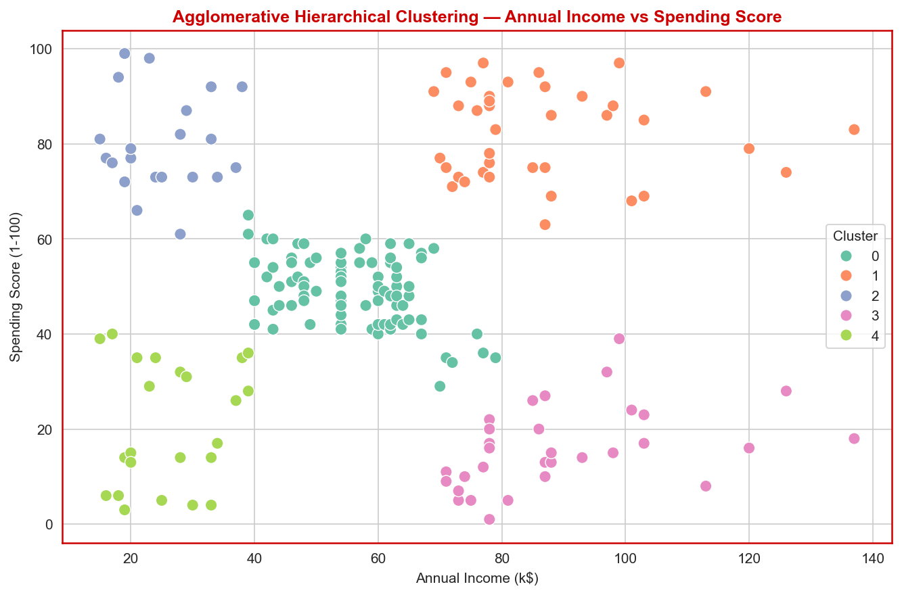
*Figure 8 — Hierarchical clusters on Annual Income vs Spending Score.*

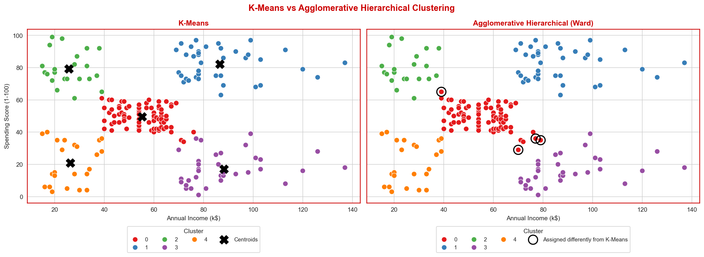
*Figure 9 — K-Means (left) vs Hierarchical (right). Only 4 of 200 customers, circled in black, are assigned differently, all on the border of the central group.*

### Task 5 — DBSCAN

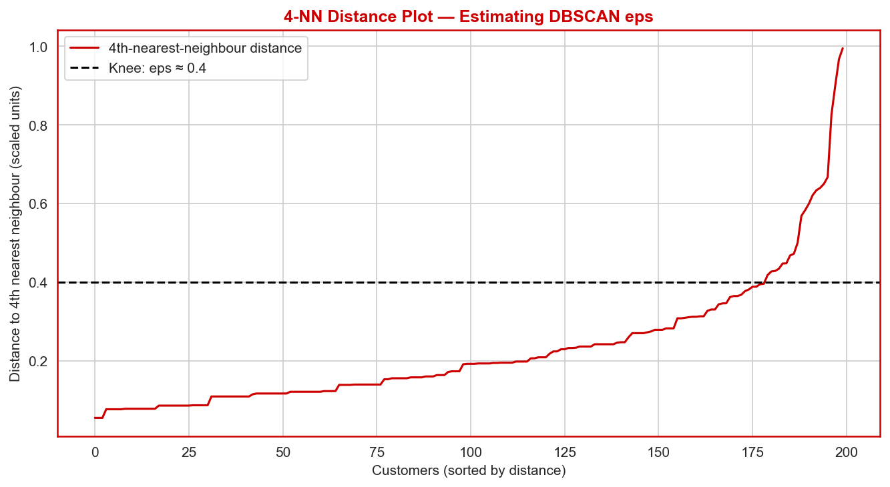
*Figure 10 — 4-NN distance plot used to estimate `eps`. The knee is at about 0.4.*

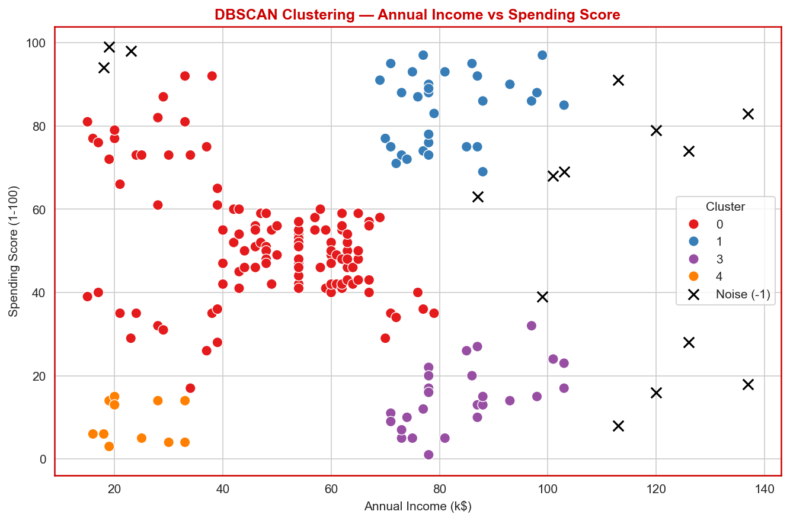
*Figure 11 — DBSCAN result (`eps = 0.4`, `min_samples = 5`): 4 clusters and 15 noise points shown as black x markers.*

### Task 6 — Comparison

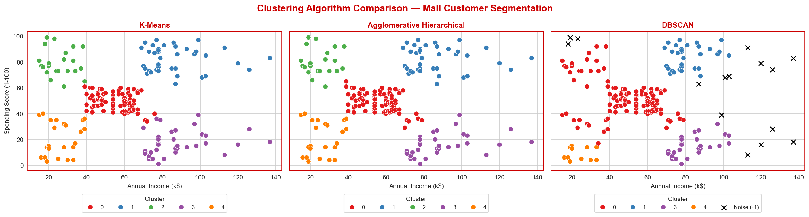
*Figure 12 — K-Means, Hierarchical and DBSCAN side by side on the same axes, using consistent colours.*

---

## ⚖️ Algorithm Comparison

| Algorithm | Clusters | Noise points | Silhouette ↑ | Davies-Bouldin ↓ | Calinski-Harabasz ↑ |
|---|---|---|---|---|---|
| **K-Means** | 5 | 0 | **0.555** | **0.572** | **248.6** |
| **Agglomerative (Ward)** | 5 | 0 | 0.554 | 0.578 | 244.4 |
| **DBSCAN** (eps = 0.4, min_samples = 5) | 4 | 15 | 0.478 | 0.591 | 146.9 |

*DBSCAN metrics are calculated without the noise points.*

**Takeaways**

- K-Means is best on all three metrics, with Hierarchical clustering almost identical.
- DBSCAN connects the Average, Low Income High Spenders and part of the Low Income Low Spenders groups because they touch at their edges, so it finds 4 dense regions instead of 5 segments.
- With all 4 features (extension) the silhouette score drops to about 0.30–0.36, so the 2-feature subset is used for the main analysis.

---

## 💡 Business Insights

Segments found by K-Means (the most interpretable result), with one recommended action each:

| Segment | Customers | Avg. age | Avg. income | Avg. score | Recommended marketing action |
|---|---|---|---|---|---|
| **High Income, High Spenders** | 39 | ≈ 33 | ≈ 86k | ≈ 82 | Loyalty / VIP programme with early access to new collections |
| **Low Income, High Spenders** | 22 | ≈ 25 | ≈ 26k | ≈ 79 | Budget promotions, flash sales and instalment options |
| **High Income, Low Spenders** | 35 | ≈ 41 | ≈ 88k | ≈ 17 | Personalised re-engagement: premium dining, events and a short survey |
| **Low Income, Low Spenders** | 23 | ≈ 45 | ≈ 26k | ≈ 21 | Low-cost footfall offers: coupons on everyday essentials |
| **Average Income, Average Spenders** | 81 | ≈ 43 | ≈ 55k | ≈ 50 | Bundles, seasonal offers and a points scheme to move them up |

**Recommended algorithm: K-Means** — best metrics, easiest to explain and new customers can be assigned instantly. Hierarchical clustering is useful for showing management how segments group together, and DBSCAN is useful for finding unusual customers.

---

## 🛠️ Tools & Technologies

| Tool | Purpose |
|---|---|
| **Python 3.12** | Programming language |
| **Jupyter Notebook** | Interactive analysis and reporting |
| **pandas / NumPy** | Data loading, cleaning and numerical work |
| **scikit-learn** | `KMeans`, `AgglomerativeClustering`, `DBSCAN`, `StandardScaler`, `LabelEncoder`, `NearestNeighbors`, evaluation metrics |
| **SciPy** | `linkage` and `dendrogram` for hierarchical clustering |
| **Matplotlib / Seaborn** | All visualisations |
| **Git & GitHub** | Version control and submission |

---

## 📦 Requirements & Installation

Libraries used (pinned in [`requirements.txt`](requirements.txt), tested on Python 3.12):

```text
pandas==3.0.2
numpy==2.4.4
matplotlib==3.10.8
seaborn==0.13.2
scikit-learn==1.8.0
scipy==1.17.1
jinja2==3.1.6
```

**Run it yourself**

```bash
# 1. Clone the repository
git clone https://github.com/[YOUR_USERNAME]/[YOUR_REPO_NAME].git
cd [YOUR_REPO_NAME]

# 2. (Optional) create a virtual environment
python -m venv venv
venv\Scripts\activate          # Windows
# source venv/bin/activate     # macOS / Linux

# 3. Install the dependencies and Jupyter
pip install -r requirements.txt
pip install jupyter

# 4. Open the notebook
jupyter notebook UL_PR1.ipynb
```

Use **Kernel → Restart & Run All** to reproduce every result. The notebook expects `Mall_Customers.csv` in the same folder and creates the `screenshots/` folder automatically.

---

## 📁 Repository Structure

```text
.
├── UL_PR1.ipynb            # Main notebook (all 7 tasks, executed)
├── UL_PR1.html             # HTML export of the notebook
├── Mall_Customers.csv      # Dataset (Kaggle, CC0)
├── requirements.txt        # Python dependencies with versions
├── README.md               # Project documentation
└── screenshots/            # Key plots used in this README
    ├── 01_univariate_distributions.png
    ├── 02_pairplot.png
    ├── 03_correlation_heatmap.png
    ├── 04_elbow_method.png
    ├── 05_silhouette_scores.png
    ├── 06_kmeans_clusters.png
    ├── 07_dendrogram_ward.png
    ├── 08_hierarchical_clusters.png
    ├── 09_kmeans_vs_hierarchical.png
    ├── 10_knn_distance_plot.png
    ├── 11_dbscan_clusters.png
    └── 12_three_panel_comparison.png
```

---

## 👤 Author

**Tanna Herit** — GRID: 11431  
