# 💳 Credit Card Customer Segmentation — Unsupervised Learning

> **Practical Exam (Set C)** · K-Means · Agglomerative Hierarchical Clustering · DBSCAN
> Segmenting ~8,950 credit-card holders into behavioural personas that a bank's Relationship Managers can act on.

  

---

## 📌 Table of Contents
1. [Project Overview](#-project-overview)
2. [Dataset](#-dataset)
3. [Video Explanation](#-video-explanation)
4. [Repository Structure](#-repository-structure)
5. [Setup & How to Run](#-setup--how-to-run)
6. [Methodology](#-methodology)
7. [Results & Screenshots](#-results--screenshots)
8. [Cluster Personas](#-cluster-personas)
9. [Using the Saved Model](#-using-the-saved-model)
10. [Key Learnings & Limitations](#-key-learnings--limitations)
11. [Author](#-author)

---

## 🎯 Project Overview
The credit-cards division of a large Indian private bank wants to move away from a one-size-fits-all approach to card upgrades, reward programmes and credit-limit revisions. This project groups existing cardholders into **meaningful behavioural segments** so that the right product is offered to the right customer, which reduces attrition and increases wallet share.

**What I did**
- Explored the data (missing values, distributions, correlations, Pareto 80/20 analysis)
- Engineered 4 behavioural features, capped outliers, log-transformed skewed money columns and scaled everything
- Built and tuned **three** clustering algorithms: **K-Means** (elbow + silhouette), **Agglomerative** (dendrogram + 3 linkages) and **DBSCAN** (k-NN distance plot + grid search)
- Compared them using **Silhouette, Davies-Bouldin and Calinski-Harabasz**, checked K-Means stability over 5 seeds
- Turned clusters into business personas with one action each, and saved a deployable pipeline (`predict_segment()`)

## 📊 Dataset
| Item | Details |
|---|---|
| Source | [Credit Card Dataset for Clustering — Kaggle](https://www.kaggle.com/datasets/arjunbhasin2013/ccdata) |
| File | `CC_GENERAL.csv` (included in this repo) |
| Size | 8,950 cardholders × 18 columns (`CUST_ID` is dropped, 17 numeric features used) |
| Key columns | `BALANCE`, `PURCHASES`, `CASH_ADVANCE`, `CREDIT_LIMIT`, `PAYMENTS`, `MINIMUM_PAYMENTS`, `PRC_FULL_PAYMENT`, `TENURE` and frequency columns |
| Missing values | `CREDIT_LIMIT` (1) and `MINIMUM_PAYMENTS` (313), imputed with the median |

## 🎥 Video Explanation
**▶️ Watch the project walkthrough (face + screen, ~8 min):** [PASTE YOUR GOOGLE DRIVE / YOUTUBE (UNLISTED) LINK HERE](PASTE_LINK_HERE)

## 📁 Repository Structure
```
creditcard-segmentation-unsupervised-learning/
├── CreditCardSegmentation_UnsupervisedLearning.ipynb   # fully executed notebook (all outputs and plots)
├── CC_GENERAL.csv                                      # dataset
├── cc_scaler.pkl                                       # saved StandardScaler
├── cc_segmentation_model.pkl                           # saved best model (K-Means, k=4)
├── cc_preprocessing.pkl                                # caps, medians, feature order, persona map (used by predict_segment)
├── customer_segments.csv                               # every customer with all 3 cluster labels + personas
├── summary_report.md                                   # ~450-word business/algorithm summary
├── requirements.txt                                    # dependencies
├── README.md                                           # this file
└── images/                                             # screenshots of the key plots (+ interactive 3-D HTML)
```

## ⚙️ Setup & How to Run
```bash
# 1. Clone the repository
git clone https://github.com/<your-username>/creditcard-segmentation-unsupervised-learning.git
cd creditcard-segmentation-unsupervised-learning

# 2. (Recommended) create a virtual environment
python -m venv venv
venv\Scripts\activate          # Windows
# source venv/bin/activate     # macOS / Linux

# 3. Install the requirements
pip install -r requirements.txt

# 4. Open and run the notebook top-to-bottom
jupyter notebook CreditCardSegmentation_UnsupervisedLearning.ipynb
```
Running the notebook from top to bottom takes a few minutes and regenerates the plots in `images/`, the three `.pkl` files and `customer_segments.csv`.
> The `.pkl` files were created with scikit-learn 1.8. If you use a different version and see a version warning, just re-run the notebook to regenerate them.

## 🔬 Methodology
| Step | What was done |
|---|---|
| **1. EDA** | Shape/info/head, missing values, duplicates, log-scale histograms, TENURE boxplot, correlation heatmap, utilisation, top cash-advance customers, % with no purchases, Pareto analysis |
| **2. Feature engineering** | `Monthly_Avg_Purchase`, `Monthly_Avg_Cash_Advance`, `Limit_Usage`, `Payment_to_Minpayment_Ratio` |
| **3. Outliers** | IQR winsorising at Q3 + 3×IQR (no rows dropped) on 12 money/engineered columns |
| **4. Skewness** | `log1p` on the money columns (skew ≈ 1.7 → ≈ 0) |
| **5. Scaling** | `StandardScaler` on 21 features (PCA: 9 components keep 90% variance, reported only) |
| **6. K-Means** | k = 2…10, elbow + silhouette, final **k = 4** |
| **7. Hierarchical** | Ward dendrogram, cut at distance 140.7 → 4 clusters, compared Ward / Complete / Average → **Ward** |
| **8. DBSCAN** | k-NN distance elbow (eps ≈ 2.4), 32-combination grid search, best **eps = 2.5, min_samples = 10** |
| **9. Evaluation** | Silhouette, Davies-Bouldin, Calinski-Harabasz, noise %, K-Means stability across seeds 0/7/21/42/99 |
| **10. Deployment** | `joblib` scaler + model and a `predict_segment()` function tested on 5 hypothetical customers |

## 📈 Results & Screenshots

### Algorithm comparison
| Algorithm | Hyperparameters | Clusters | Silhouette ↑ | Davies-Bouldin ↓ | Calinski-Harabasz ↑ | Noise |
|---|---|---|---|---|---|---|
| **K-Means** ✅ | k=4, n_init=20 | 4 | **0.198** | 1.71 | **2,057** | 0% |
| Agglomerative | Ward, 4 clusters | 4 | 0.142 | 2.00 | 1,595 | 0% |
| DBSCAN | eps=2.5, min_samples=10 | 2 | 0.174 | 1.13 | 24 | 3.2% |

- **Best overall: K-Means**, which has balanced clusters (18% to 28% each) and is very stable: Silhouette = 0.1974 ± 0.0001 over 5 seeds.
- DBSCAN's low Davies-Bouldin is misleading because 96.7% of customers fall into one cluster. Its real value is finding **284 unusual accounts (3.2%)** for manual review.
- Silhouette near 0.2 means the segments overlap, so they should be treated as soft segments.

### Key EDA findings
- **22.84%** of customers have never made a purchase.
- **26.2%** of customers generate **80%** of purchase volume (close to the Pareto rule).
- Heavy cash-advance users are mostly a *different* group from big spenders (Spearman correlation = −0.39).

### Plots
| | |
|---|---|
| 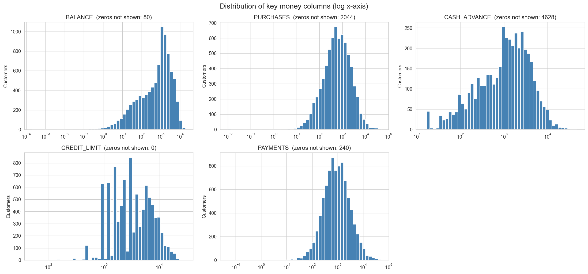 **Log-scale histograms** | 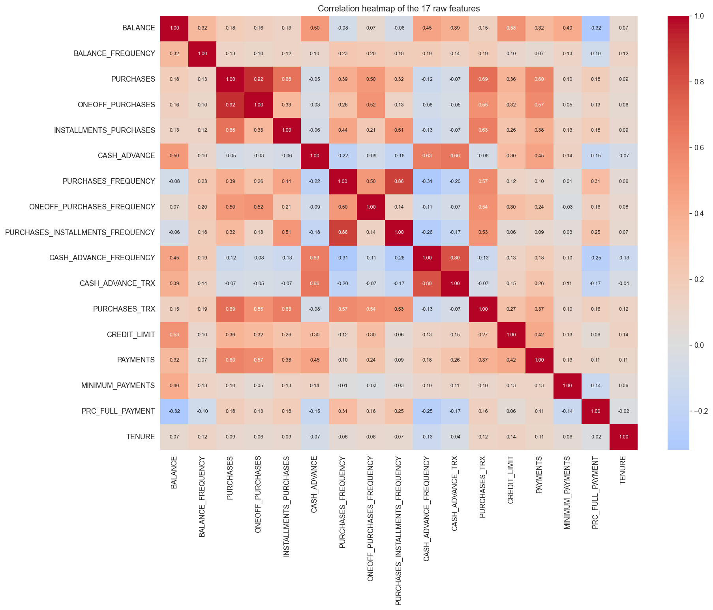 **Correlation heatmap** |
| 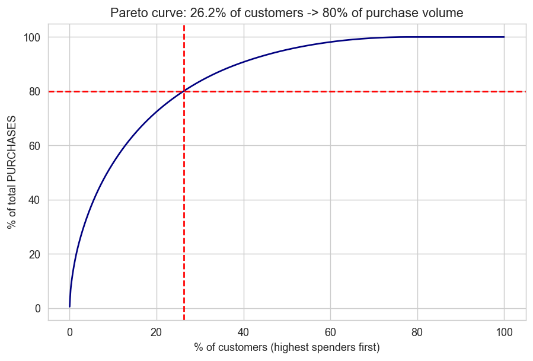 **Pareto curve** | 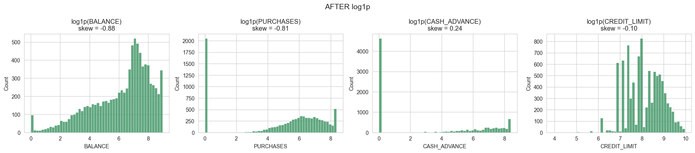 **After log1p** |

**K-Means: elbow + silhouette**
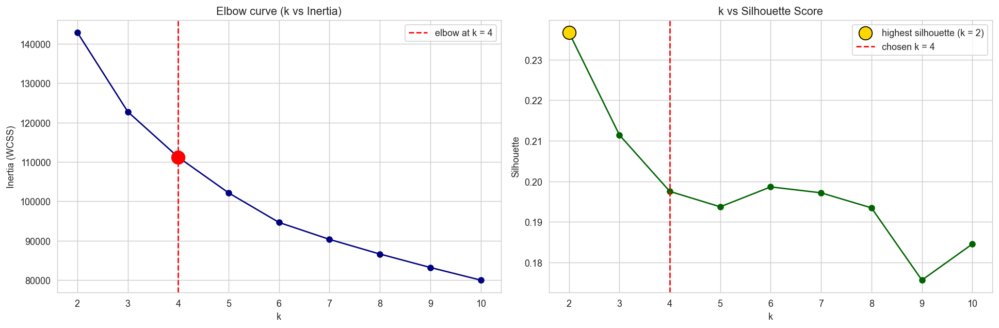

**K-Means: 3-D clusters** (an interactive version is in `images/kmeans_3d_interactive.html`)
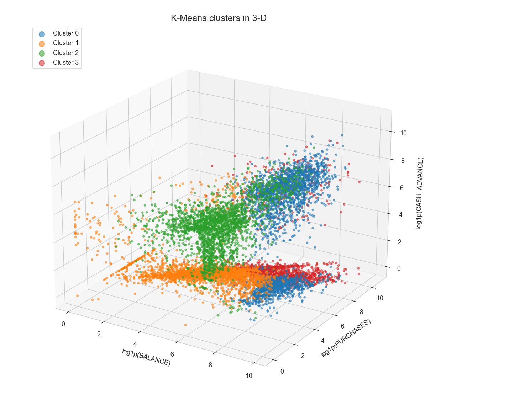

**K-Means: 2-D clusters and profile heatmap**
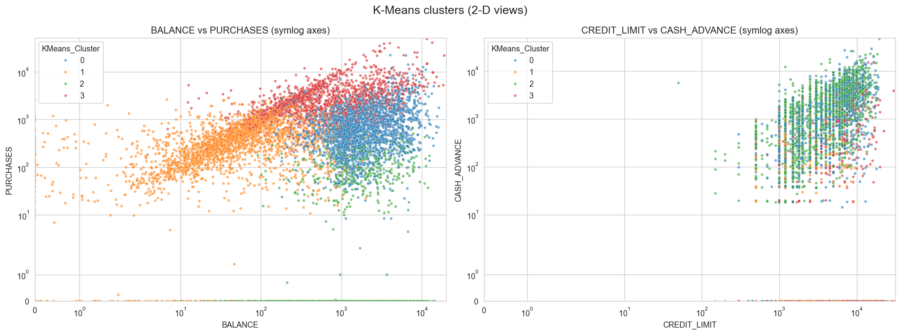
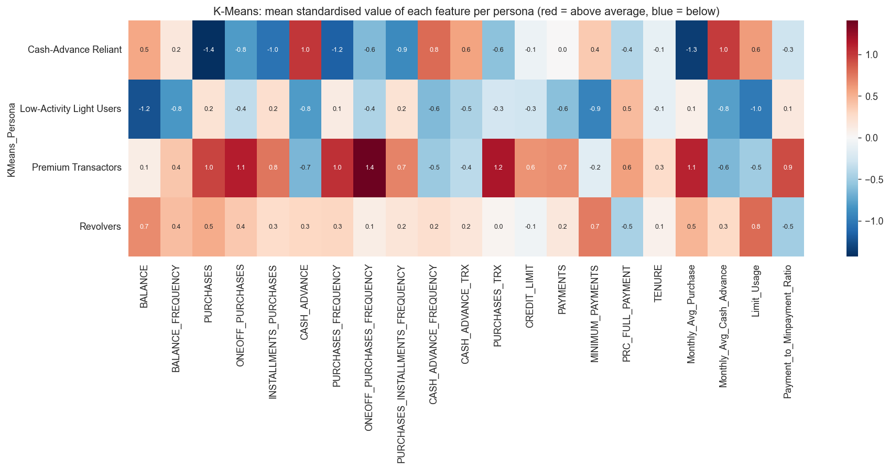

**Hierarchical: dendrogram with cut line**
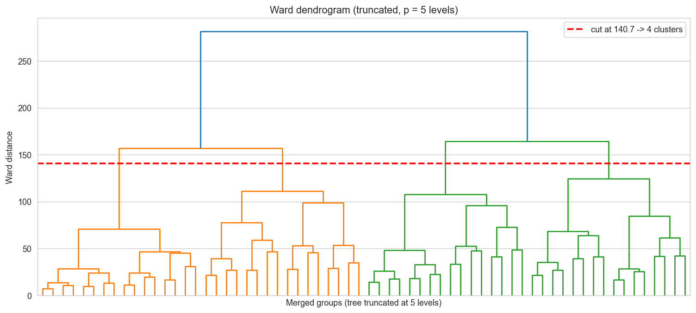
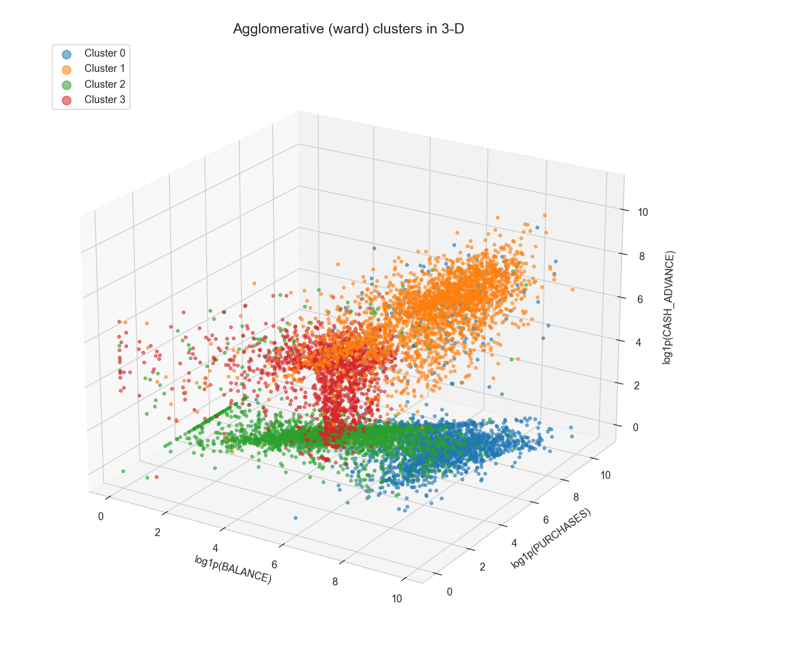

**DBSCAN: k-NN distance plot, grid heatmap and clusters (noise in grey)**
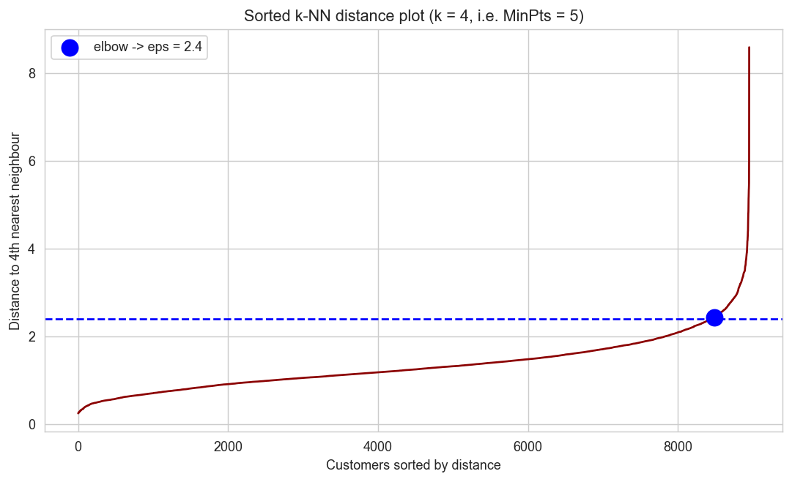
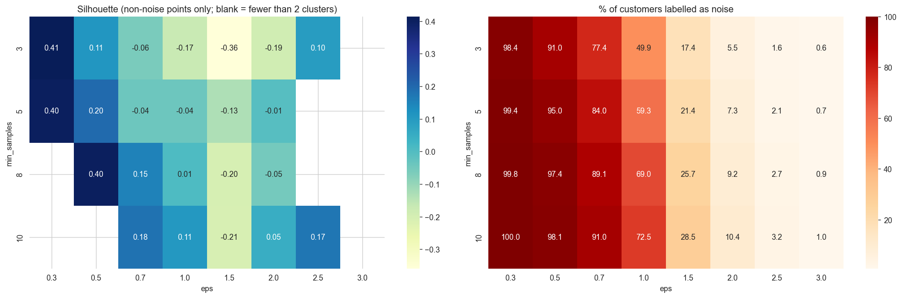
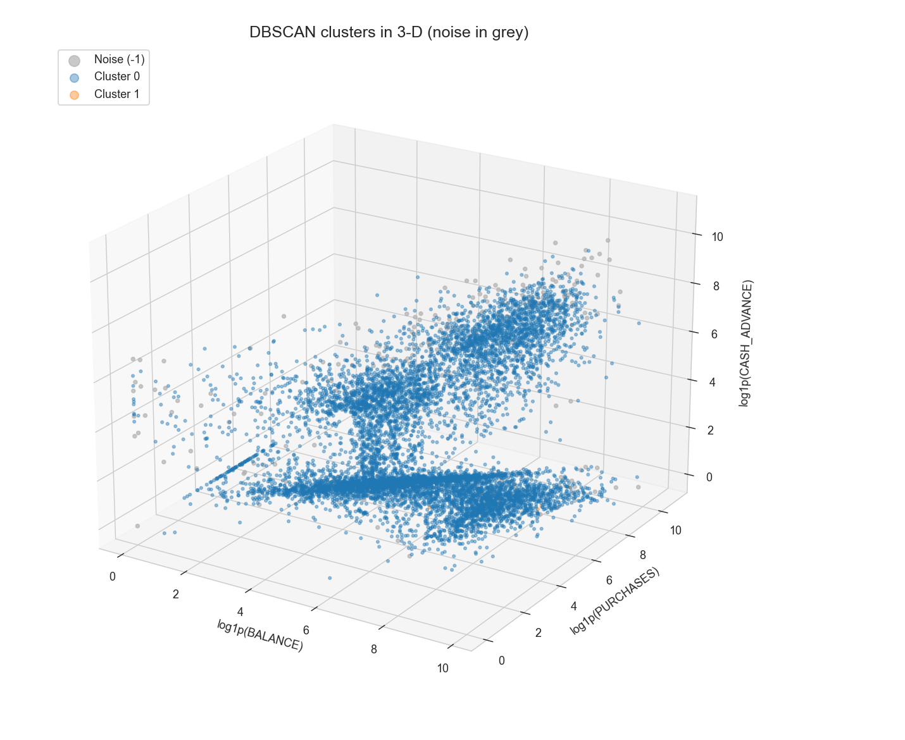

**Metric comparison**
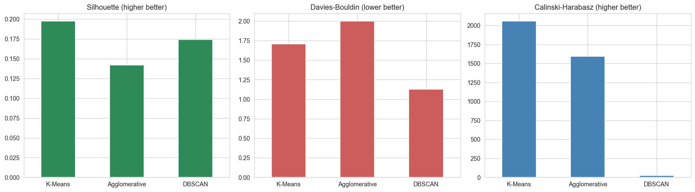

## 👥 Cluster Personas
The four **K-Means** segments (recommended for deployment), with one action each:

| Persona | Share | Profile (from cluster means) | Recommended action |
|---|---|---|---|
| 🥇 **Premium Transactors** | 18.4% | Highest purchases (≈3,284) and credit limit (≈6,786); buy in ~91% of months; only ~20% limit usage; often pay in full | Upgrade to a **premium rewards / co-branded card** with a higher limit and category cashback |
| 🔁 **Revolvers** | 27.1% | High balance (≈2,546), ~67% limit usage, pay only ~2× the minimum, almost never in full | Offer a **balance-transfer EMI plan** or EMI conversion; monitor for stress |
| 💵 **Cash-Advance Reliant** | 26.4% | Almost no purchases (≈22) but heavy cash advance (≈2,161) and high balance; use the card as a loan | Offer a cheaper **pre-approved personal loan / cash line**, with credit-risk monitoring |
| 💤 **Low-Activity Light Users** | 28.1% | Balance ≈113, ~5% limit usage, low spend and payments; nearly dormant | Send a **reactivation offer with waived annual fee** and small spend-and-earn cashback |

**DBSCAN extra view (risk watch-list):**
- **Extreme / Unusual Accounts (284 customers, 3.2%)**: about 3.3× the cash advance and 4.4× the payment-to-minimum ratio of normal customers, so they need manual Relationship Manager or credit-risk review.
- **Non-Paying Active Spenders (15 customers)**: buy often but have zero payments, a possible delinquency or fraud signal.

## 🚀 Using the Saved Model
```python
import pandas as pd, joblib
# run the predict_segment() cell from Step 7 of the notebook first, or copy the function from there

new_customer = pd.DataFrame([{
    'BALANCE': 4200, 'BALANCE_FREQUENCY': 1.0, 'PURCHASES': 1500, 'ONEOFF_PURCHASES': 900,
    'INSTALLMENTS_PURCHASES': 600, 'CASH_ADVANCE': 500, 'PURCHASES_FREQUENCY': 0.6,
    'ONEOFF_PURCHASES_FREQUENCY': 0.3, 'PURCHASES_INSTALLMENTS_FREQUENCY': 0.4,
    'CASH_ADVANCE_FREQUENCY': 0.1, 'CASH_ADVANCE_TRX': 2, 'PURCHASES_TRX': 20,
    'CREDIT_LIMIT': 9000, 'PAYMENTS': 900, 'MINIMUM_PAYMENTS': 850, 'PRC_FULL_PAYMENT': 0.0, 'TENURE': 12}])

predict_segment(new_customer)      # -> Cluster 0, Persona: Revolvers
```
`predict_segment()` repeats the exact training pipeline (engineer → cap → log1p → scale → K-Means → persona), and it reproduced the training labels for 100% of a 500-customer check.

## 🧠 Key Learnings & Limitations
- Clustering behaviour data needs **outlier capping + log transform + scaling**, otherwise a few huge accounts dominate the distances.
- **Silhouette alone can mislead**: average linkage (0.39) and small-eps DBSCAN (0.40) scored highest by isolating a few outliers or discarding 98% of customers as noise. I added size and noise constraints before choosing.
- Customer behaviour is a **continuum**, so the segments overlap (Silhouette ≈ 0.2) and DBSCAN sees one dense blob.
- **Next steps:** add merchant-category, repayment-history, bureau-score and income data, use monthly time series, try semi-supervised refinement, and wrap `predict_segment()` in a FastAPI scoring service.

## 👤 Author
**Herit**  
GR ID: `11431`
